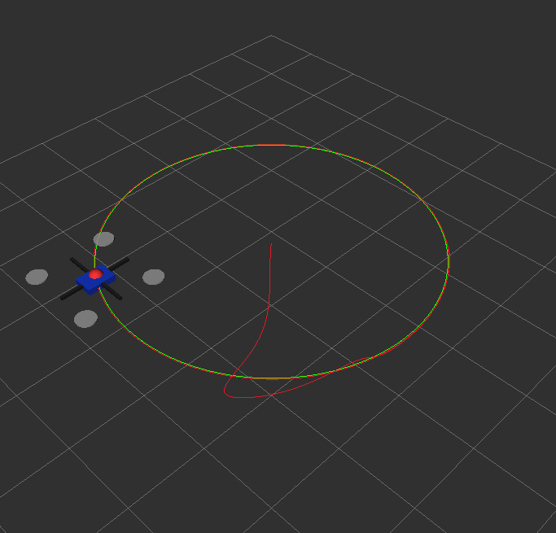
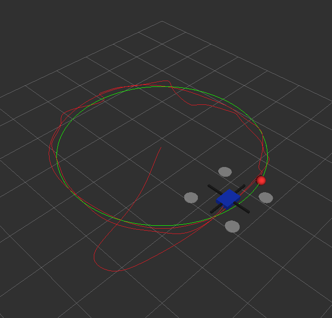
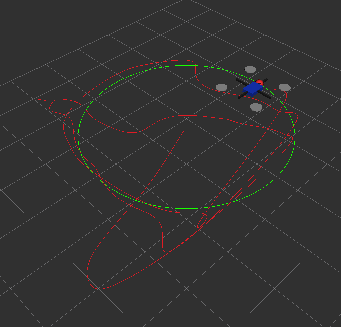

# ROS 2 Drone MPC Tracking Demo under Wind Disturbance

This project demonstrates a ROS 2-based UAV trajectory tracking system using MPC, simulated drone dynamics, URDF/RViz visualization, and wind disturbance robustness evaluation.

It is designed as a compact ROS 2 learning and demonstration project, not a high-fidelity aerodynamic UAV simulator.

## Main Features

- ROS 2 Jazzy multi-node system
- Simulated drone dynamics with first-order velocity response
- MPC tracking controller
- P-controller baseline
- URDF quadrotor model
- TF and RViz visualization
- Wind disturbance levels
- Selectable trajectory modes
- Real-time tracking-error topic
- CSV logging and metric analysis

## System Architecture

```text
trajectory reference
        |
        v
   MPC tracker
        |
        v
 /drone/cmd_vel
        |
        v
   simulator
        |
        v
/drone/odom + TF
        |
        v
      RViz
```

Compact view:

```text
trajectory reference -> MPC tracker -> /drone/cmd_vel -> simulator -> /drone/odom + TF -> RViz
```

## ROS Topics

- `/drone/cmd_vel`
- `/drone/odom`
- `/drone/ref_path`
- `/drone/actual_path`
- `/drone/reference_marker`
- `/drone/tracking_error`
- `/tf`
- `/robot_description`

## Requirements

- Ubuntu 24.04
- ROS 2 Jazzy
- Python 3
- `scipy`
- `numpy`
- `pandas`
- `matplotlib`
- `robot_state_publisher`
- `rviz2`

## Build

```bash
cd ~/ros2_ws
colcon build --packages-select drone_tracking_demo
source install/setup.bash
```

## Run

No-wind circle tracking:

```bash
ros2 launch drone_tracking_demo full_demo.launch.py wind_level:=none trajectory_mode:=circle
```

Strong-wind circle tracking:

```bash
ros2 launch drone_tracking_demo full_demo.launch.py wind_level:=strong trajectory_mode:=circle
```

Strong-wind random smooth tracking:

```bash
ros2 launch drone_tracking_demo full_demo.launch.py wind_level:=strong trajectory_mode:=random_smooth
```

## Launch Options

Available wind levels:

- `none`
- `mild`
- `moderate`
- `strong`
- `extreme`

Available trajectory modes:

- `circle`
- `figure8`
- `random_smooth`

## Metrics and Analysis

The MPC tracker publishes real-time tracking error on:

```text
/drone/tracking_error
```

It also saves CSV logs to:

```text
~/ros2_ws/drone_tracking_logs/mpc_tracking_log.csv
```

To compare no-wind and strong-wind runs, first run the no-wind case and save the generated log:

```bash
cp ~/ros2_ws/drone_tracking_logs/mpc_tracking_log.csv ~/ros2_ws/drone_tracking_logs/mpc_tracking_log_no_wind.csv
```

Then run the strong-wind case and save that generated log:

```bash
cp ~/ros2_ws/drone_tracking_logs/mpc_tracking_log.csv ~/ros2_ws/drone_tracking_logs/mpc_tracking_log_wind_strong.csv
```

Run the analysis script:

```bash
python3 analyze_wind_metrics.py
```

Example metric results:

- No-wind steady-state RMSE after 5 s: `0.0158 m`
- Strong-wind steady-state RMSE after 5 s: `0.2948 m`
- No-wind gust-window RMSE from 12-18 s: `0.0122 m`
- Strong-wind gust-window RMSE from 12-18 s: `0.4001 m`
- Gust-window RMSE increase: about `32.8x`

## Demo Results



ROS 2 RViz UAV tracking visualization for the circular reference trajectory with no wind.



Strong-wind circular trajectory tracking result in RViz, intended for comparison with the no-wind trajectory above.



Extreme-wind disturbance tracking view in RViz; this qualitatively illustrates larger tracking-error behavior under severe wind disturbance rather than a numeric metric plot.

## Suggested Demo Video Sequence

1. No-wind circle tracking
2. Strong-wind circle tracking
3. `random_smooth` trajectory under strong wind
4. Metric plot comparison

## Future Work

- PX4/Gazebo integration
- Obstacle avoidance
- Visual tracking
- RL-based controller
- Real UAV deployment
